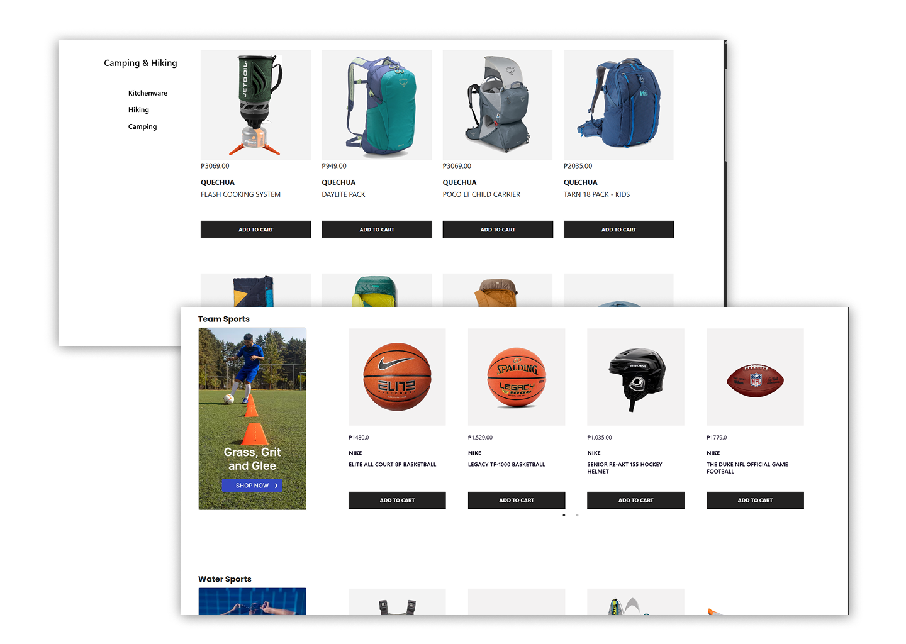

# E-Commerce Web Application

## 📌 Project Description
This is a web-based e-commerce application developed as a school project.
The system supports two types of users: Buyers and Sellers, each with different roles and features.
The web application communicates with a Flask REST API backend and uses MySQL as the database.

## 👥 User Roles & Features

### 🛒 Buyer Features
- Registration and login
- Browse available products
- View product details
- Add products to cart
- Place orders
- View order history
- Message sellers
-Give feedback or report

### 🏪 Seller Features
- Registration and login
- Add new products
- Edit and delete products
- Manage product inventory
- View customer orders
- Update order status
- View sales record
- Manage discount vouchers
- Interact with buyers
-View feedbacks

## 🛠 Technologies Used
- HTML
- CSS
- JavaScript
- Bootstrap 
- Python
- Flask
- MySQL
- REST API

## Screenshots
### Buyer View

### Seller View

## Related Repositories
- Mobile App: https://github.com/christineval/E-Commerce-Mobile-Application
